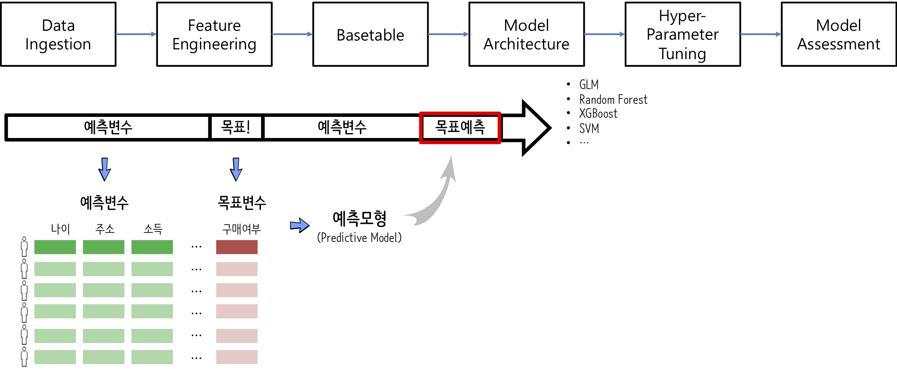

 
``` {r, include=FALSE}
# source("tools/chunk-options.R")

knitr::opts_chunk$set(echo = TRUE, warning=FALSE, message=FALSE,
                    comment="", digits = 3, tidy = FALSE, prompt = FALSE, fig.align = 'center')

library(tidyverse)
```

# Concept map [^tidyverse-ml] {#RStudio-concept-map}

[^tidyverse-ml]: [이광춘 (2018/10/07), "Tidyverse와 기계학습(ML)", 데이터뽀개기 2018 - Hello Kaggler!](https://statkclee.github.io/ds-authoring/machine_learning_tidyverse_20181007.html)

{#id .class width="100%"}


