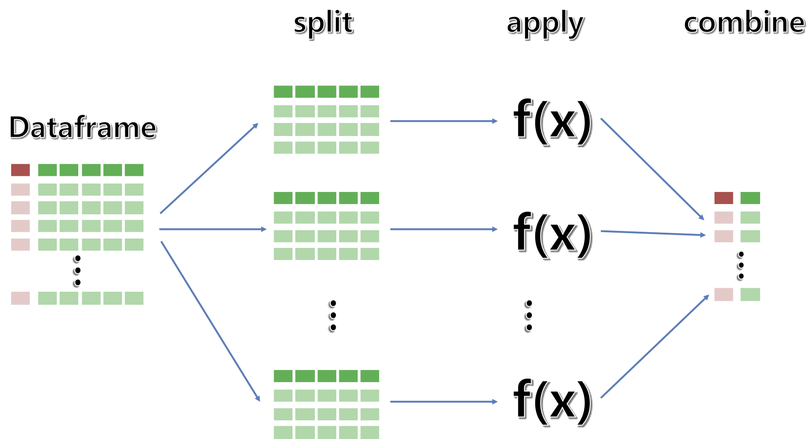

 
``` {r, include=FALSE}
# source("tools/chunk-options.R")

knitr::opts_chunk$set(echo = TRUE, warning=FALSE, message=FALSE,
                    comment="", digits = 3, tidy = FALSE, prompt = FALSE, fig.align = 'center')

library(tidyverse)
```

# Concept map {#RStudio-concept-map}


{#id .class width="100%"}


